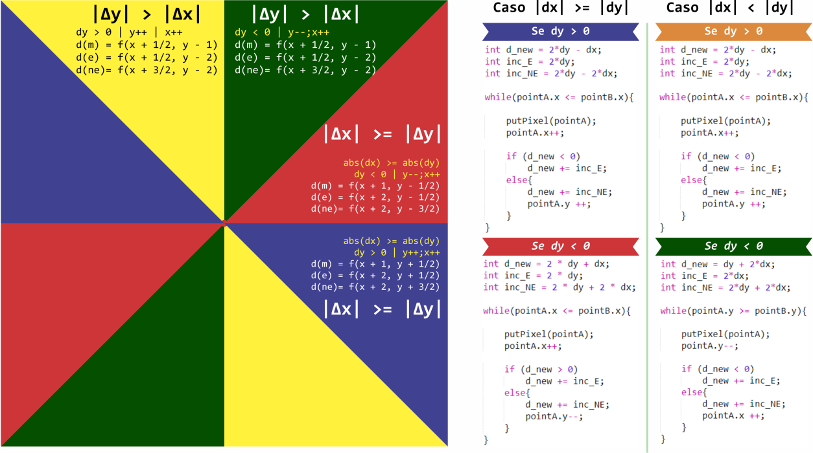

# T1 ICG - Rasterização de Linhas

## Introdução

  Este trabalho tem como objetivo apresentar alguns algoritmos para rasterização de linhas em um monitor gráfico diretamente e memória de video, como os sistema operacionais modernos impedem acesso direto a memória de vídeo, foi utilizado um framework para realizar esta simulação.

  Mas antes, devemos tomar conhecimento do que são primitivas, rasterização, como rasterizar primitivas gráficas e o funcionamento em um monitor gráfico.
  
## Rasterização

  Primitivas em computação gráfica são elementos básicos, como pontos e retas. A rasterização é responsável por capturar estas primitivas e transformá-las em novas imagens, ou seja, é justamente o que acontece em monitores, displays, e até mesmo impressoras.

## Monitores

  Inicialmente devemos imaginar o display como uma matriz _(grid)_ bidimensional, composto por **_m linhas_** e **_n colunas_**, onde no centro de cada posição da matriz existe um ponto com um par de coordenadas _(x,y)_. 
  
  
  
  Note, na figura acima o Ponto _(0,0)_ está situado no topo a esquerda, e o Ponto _(m-1, n-1)_ está posicionado no canto inferior direito. Assim estão dispostos os pontos em um display.
